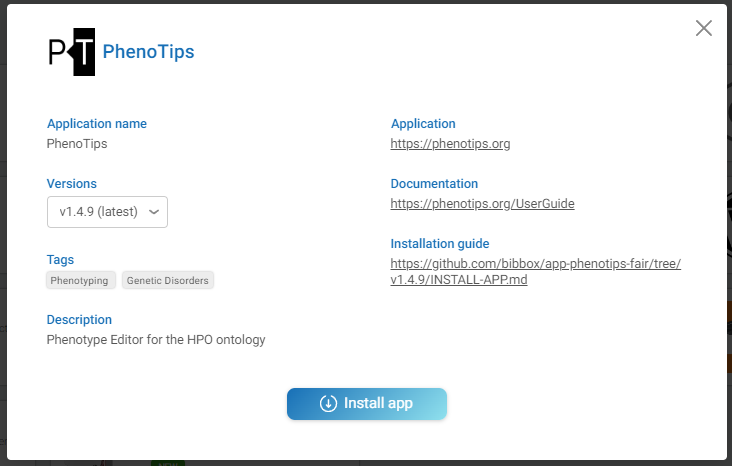
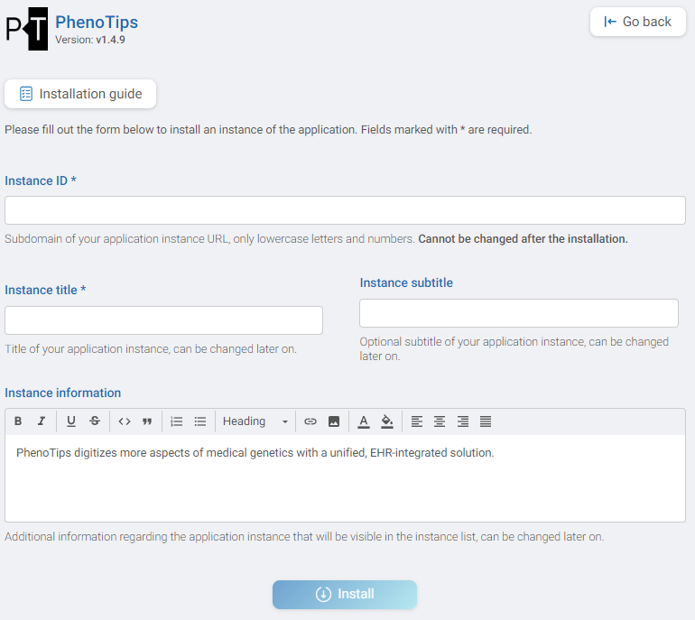
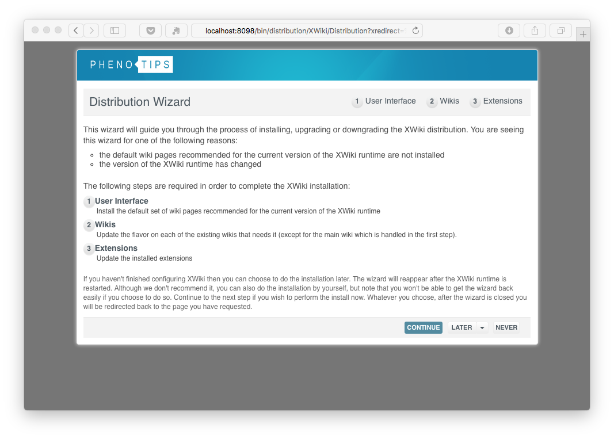
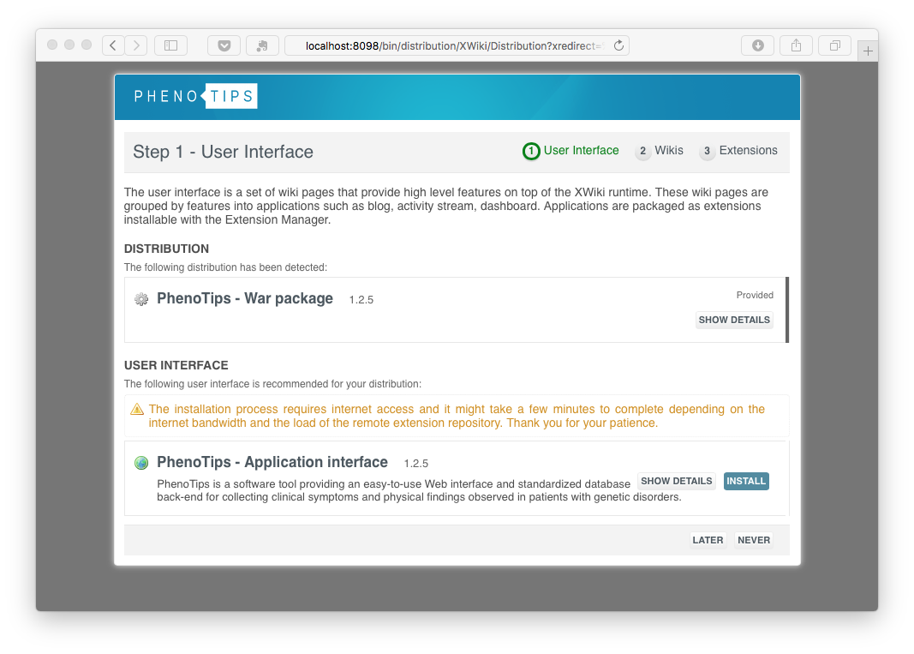
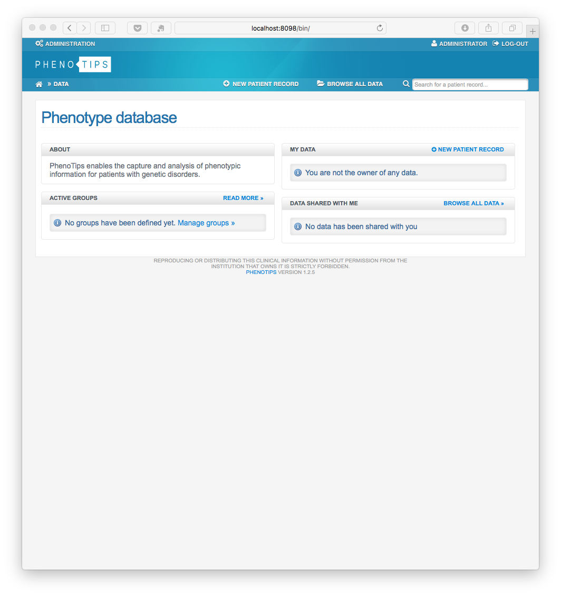
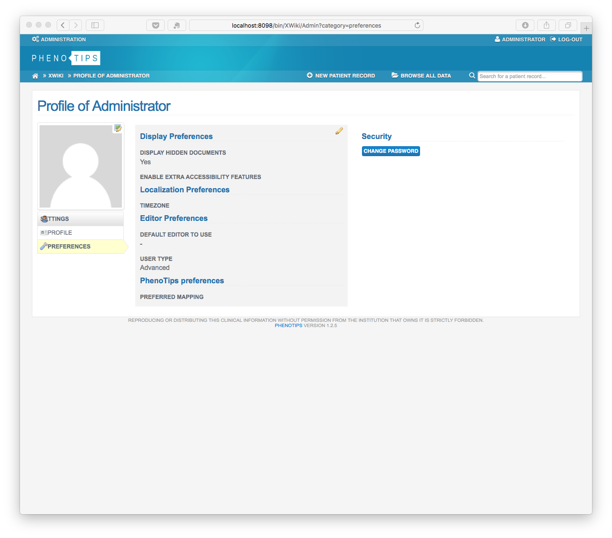

# APP-PHENOTIPS Installation Instructions  

The application can be installed either within the BIBBOX environment or as a stand-alone solution. Installation instructions can be found within the BIBBOX, followed by setup instructions required once the application has been successfully installed.

## Installation within in the BIBBOX

Once you've selected the desired App for your BIBBOX instance, you can choose from the available versions, as shown in the following figure.

Clicking "Install App" will open a new window, as illustrated in the following figure. Here, you can define the necessary entries. Some fields come pre-filled with suggested options, and if left unchanged, these default values will be used as the entries.

After confirming by clicking "Install," the App will be installed as a BIBBOX instance. Once the installation is complete, you only need to follow a few steps to use the App for the first time, which are described below.

## Setup after BIBBOX or stand-alone installation

* start the application
* phenotips will first intitialize its database (can take some minutes)
* in the distrubution wizard click on **CONTINUE**

* install the Phenotips Application interface by pressing **INSTALL** (this can take several minutes, up to a hour depending on your internet connectivity) 

* press **CONTINUE**. Further Phenotips components are now downloaded, maybe you run in a timeout, dont worry just login and the download of the components will continue

* INITIAL-USER:   Admin
* INITIAL-PASWORD admin

* press **CONTINUE** in some screens and you should arive at

* Change the admin password and continue with your configuration, as described at https://phenotips.org/AdminGuide/UserAdministration

## After the installation

Have a nice ride with the new Admins youngtimer.

