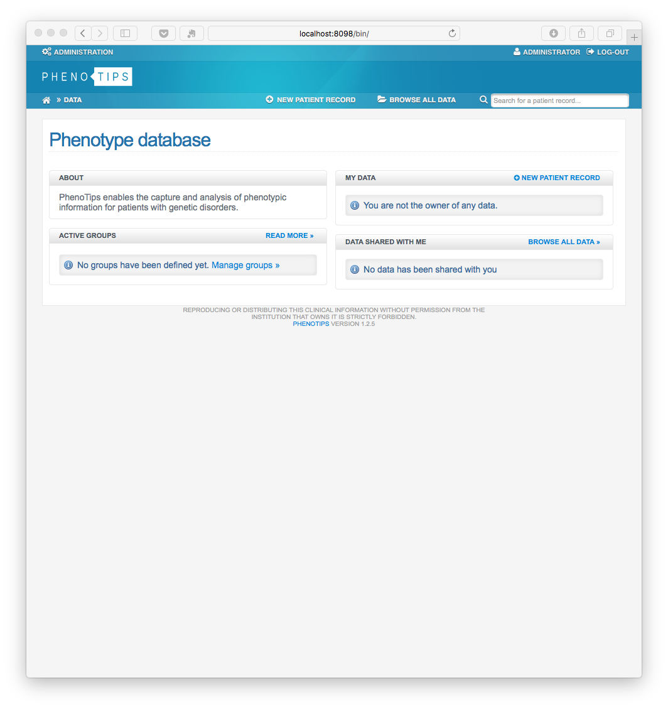

# PHENOTIPS BIBBOX application

## Hints
* approx. time with medium fast internet connection: **15 minutes**
* initial user/passwordd: **Admin / admin**

## Docker Images Used
 * [BIBBOX/phenotips](https://hub.docker.com/r/bibbox/phenotips/) 
 * [mySQL](https://hub.docker.com/_/mysql/), offical mySQL container
 * [busybox](https://hub.docker.com/_/busybox/), offical data container
 
## Install Environment Variables
  *	MYSQL_ROOT_PASSWORD = password, only used within the docker container
  * MYSQL_DATABASE = name of the mysql database, typical *phenotips*. The DB file is stored in the mounted volume
  * MYSQL_USER = name of the mysql user, typical *phenotips*
  * MYSQL_PASSWORD = mysql user password, only used within the docker container

## Mounted Volumes

* the mysql datafolder _/var/mysql_ will be mounted to _/opt/apps/INSTANCE_NAME/var/mysql_ in your BIBBOX kit 

## Installation Instructions 

* start your application in the dashboard
* phenotips will first intitialize its database (can take some minutes)
* in the distrubution wizard click on **CONTINUE**

* install the Phenotips Application interface by pressing **INSTALL** (this can take several minutes, up to a hour depending on your internet connectivity) 

* press **CONTINUE**. Further Phenotips components are now downloaded, maybe you run in a timeout, dont worry just login and the download of the components will continue

* INITIAL-USER:   Admin
* INITIAL-PASWORD admin

* press **CONTINUE** in some screens and you should arive at

* Change the admin password and continue with your configuration, as described at https://phenotips.org/AdminGuide/UserAdministration

https://raw.githubusercontent.com/bibbox/app-phenotips/tree/alpha.0.1/master/install-screen-04.png

## After the installation

Have a nice ride with the new Admins youngtimer.

